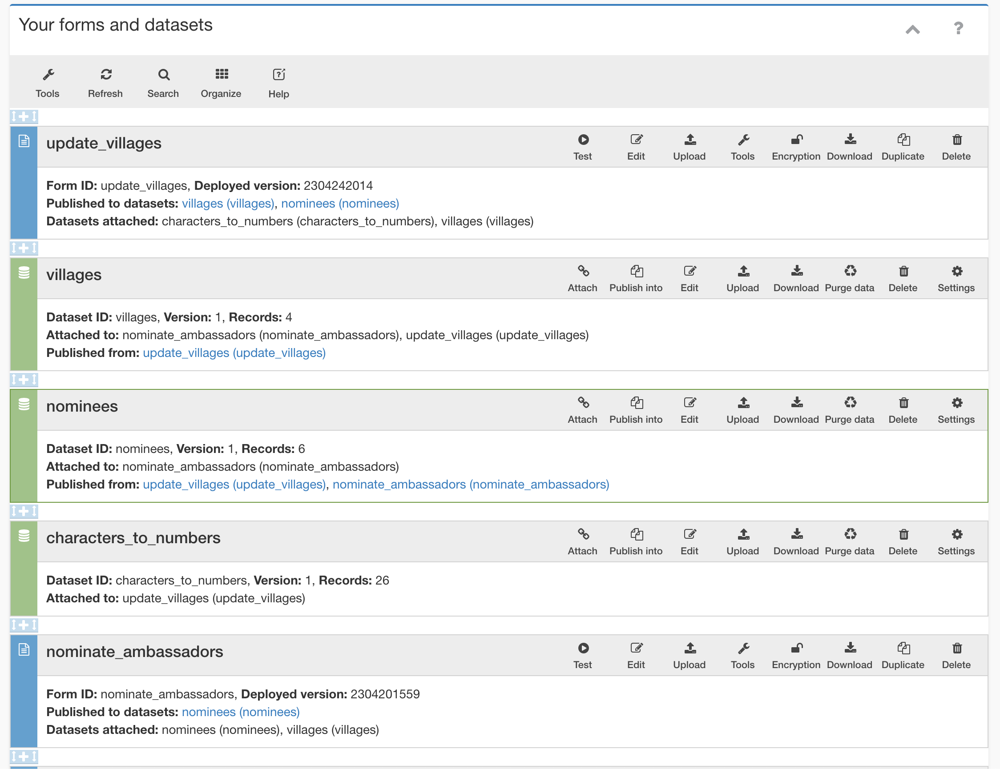

# v0.0.6

## Instructions

1. Upload nominees.csv, villages.csv, and characters_to_numbers.csv as server datasets and name them based on the file names. nominees.csv has a "dummy nominee" for each village, which the form uses to enable creation of new nominees.
1. Upload form definition update_villages.xlsx. Attach server datasets: YES, select characters_to_numbers and villages.
1. In the villages server dataset, click “Publish into”, click “Add a form”, select update_villages, and enter the following:
    
    Form field to identify unique records (optional): village_id

    Include form submissions whenever this field is 1 (optional): *(none)*
    
    Treatment of fields inside repeat groups: Publish to wide format (one row per submission)
    
    Mapping from form fields to dataset columns:
    
    | Field name | Update action | Column name |
    | --- | --- | --- |
    | district_id | Replace | district_id |
    | district_name | Replace | district_name |
    | village_name | Replace | village_name |
    | village_id | Replace | village_id |
    | village_name_full | Replace | village_name_full |
    | village_sortby | Replace | sortby |

1. In the nominees server dataset, click “Publish into”, click “Add a form”, select update_villages, and enter the following:
    
    Form field to identify unique records (optional): nominee_key
    
    Include form submissions whenever this field is 1 (optional): *(none)*
    
    Treatment of fields inside repeat groups: Publish to wide format (one row per submission)
    
    Mapping from form fields to dataset columns:
    
    | Field name | Update action | Column name |
    | --- | --- | --- |
    | district_id | Replace | district_id |
    | district_name | Replace | district_name |
    | village_name | Replace | village_name |
    | village_id | Replace | village_id |
    | nominee_key | Replace | nominee_key |
    | nominee_sortby | Replace | sortby |
    | nominee_new | Replace | nominee_new |
    | nominee_name | Replace | nominee_name |
    | nominee_phone | Replace | nominee_phone |
    | nominee_label | Replace | nominee_label |
    | n_nominations | Replace | n_nominations |

2. Upload form definition nominate_ambassadors.xlsx. Attach server datasets: YES, select characters_to_numbers, nominees, and villages.
3. In the nominees server dataset, click "Publish into", click "Add a form", select nominate_ambassadors, and enter the following:
    
    Form field to identify unique records (optional): nominee_key*
    
    Include form submissions whenever this field is 1 (optional): *(none)*
    
    Treatment of fields inside repeat groups: Publish to long format (one row per repeat instance)
    
    Mapping from form fields to dataset columns:
    
    | Field name | Update action | Column name |
    | --- | --- | --- |
    | district_id | Replace | district_id |
    | district_name | Replace | district_name |
    | village_id | Replace | village_id |
    | village_name | Replace | village_name |
    | zero | Replace | nominee_new |
    | nominee_key* | Replace | nominee_key |
    | nominee_name* | Replace | nominee_name |
    | nominee_phone* | Replace | nominee_phone |
    | nominee_label* | Replace | nominee_label |
    | nominee_sortby* | Replace | sortby |
    | one | Add | n_nominations |

4. Your Design page should now look something like this:
    
    
    
5. Go to the Collect page, and fill out the nominate_ambassadors form. If you select "Create a new nominee" in one form submission, that nominee should be visible in the next form submission. In some cases, the updating may take a few minutes, or the first round of nominees may not immediately be visible on the second form submission. You may be able to force an update of the nominees server dataset on the Design page.

6. Go to the Collect page, and fill out the update_villages form. Now, the next time you fill out the nominate_ambassadors form, the new village should be visible and you should be able to create a new nominee in that village. In some cases, the updating may take a few minutes. You may be able to force an update of the nominees server dataset on the Design page.

7. If you download the nominees server dataset, you should see a column n_nominations that keeps a running count of the number of nominations per nominee.
